# ⭐ DISCORD RPC FOR YOUTUBE MUSIC 🎺

<!DOCTYPE html>
<html lang="ko">
    <body>
        <div align="center">
            <a href="https://github.com/qwertyquerty/pypresence">
                
            </a>
            <a href="https://github.com/qwertyquerty/pypresence">
                
            </a>
            <a href="http://python.org">
                
            </a>
            <p style='color:gray'>유튜브 뮤직도 Discord RPC 기본 지원 하면 좋겠다..🙃<br>ⓒ 2023. dal.i All rights reserved.</p>
            <br>
        </div>
    </body>
</html>

- [⭐ DISCORD RPC FOR YOUTUBE MUSIC 🎺](#-discord-rpc-for-youtube-music-)
  - [⚠️ WARN](#️-warn)
  - [👁️ PREVIEW](#️-preview)
  - [⚙️ SETUP](#️-setup)
    - [0. 기본](#0-기본)
    - [1. 파이썬 설치](#1-파이썬-설치)
    - [2. 가상환경 설정](#2-가상환경-설정)
    - [3. 라이브러리 설치](#3-라이브러리-설치)
    - [4. 디버그 모드 크롬 생성하기](#4-디버그-모드-크롬-생성하기)
    - [5. 실행하기](#5-실행하기)
  - [🛟 Help! ME](#-help-me)

## ⚠️ WARN

___❌ Please do not share the `./chrome` folder generated by this program with anyone, as it contains all login information.___

___❌ 이 프로그램에서 생성된 `./chrome` 폴더에는 모든 로그인 정보가 들어 있으니 절대로 타인과 공유하지 마십시오.___

## 👁️ PREVIEW

<html lang="ko">
    <body>
        <div align="center">
            <h3>💬 In Server</h3>
            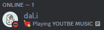
            <h3>😊 Friend Tab</h3>
            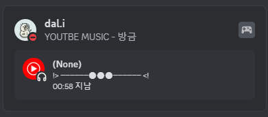
            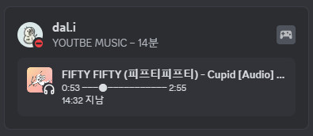
            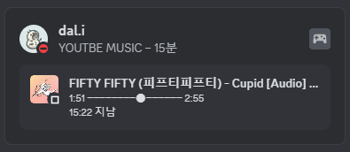
            <h3>👤 User Tab</h3>
            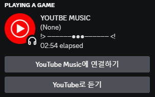
            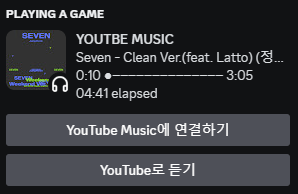
            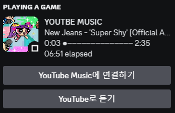
            <h3>🔍 User Detail Tab</h3>
            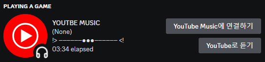
            </br>
            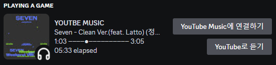
            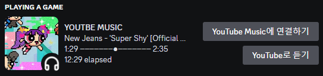
            <h3>🖱️ Mouse ON LOGO</h3>
            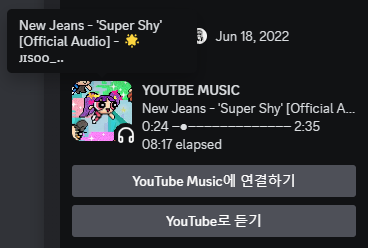
        </div>
    </body>
</html>

## ⚙️ SETUP

### 0. 기본

디스코드와 크롬을 설치한 상태에서 진행해 주세요.  

- 디스코드 세팅
    `사용자 설정` -> `활동 개인정보` -> `활동 상태`  를 활성화해 주세요
        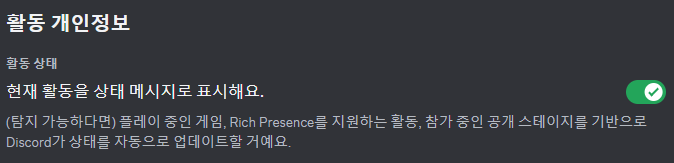  

진행 또는 사용 과정에서 발생하는 문제는 다음을 참고해 주세요.
[🛟HELPME](#🛟-help-me)

### 1. 파이썬 설치

이 파트는 이미 3.11.1 이상의 파이썬을 설치하신 분들이라면 건너뛰어도 돼요.  
[다음 챕터](#2-가상환경-설정)

Download [Python 3.11.1](https://www.python.org/downloads/release/python-3111/)  
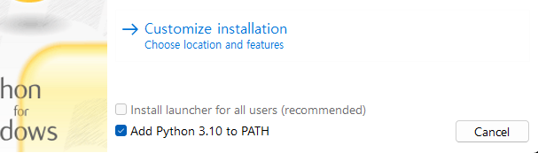  
Add Python 3.11.1 to PATH 꼭 체크하고 설치하기  
(*3.10 아니에욥!)
</br></br></br>

### 2. 가상환경 설정

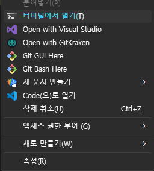  - [⭐ YOUTUBE MUSIC discord RPC 🎺](#-youtube-music-discord-rpc-)

다운로드한 파일이 있는 디렉터리에서 우클릭, 터미널을 열고  
(아니면 주소창을 클릭하여 `cmd` 를 입력해도 돼요.)  

```bash
py -m venv .venv
```

또는  

```bash
python -m venv .venv
```

명령어 입력해 주세요.  

만약 기존에 파이썬을 설치하셨던 분이라면 버전만 `3.11.1 이상`으로 맞춰서  
`.venv` 이름의 가상환경을 설치해 주시면 됩니다.
</br></br></br>

### 3. 라이브러리 설치

Python을 설치하고 가상환경을 세팅했다면 이제 라이브러리만 설치하면 돼요!  
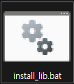  
`install_lib` 또는 `install_lib.bat` 이라고 써있는 파일을 더블클릭하여 실행해 주세요.
</br></br></br>

### 4. 디버그 모드 크롬 생성하기

열린 크롬창을 유저와 크롤러 모두 유튜브 뮤직을 제어하면서 크롤링 하기 위해서는 크롬 디버그 모드를 사용해요.

`rpc.bat` 으로 프로그램을 RPC를 실행하게 되면 자동으로 `chrome` 폴더가 생기지만  
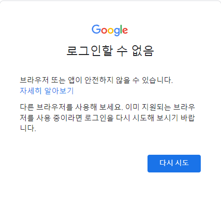  
🫣 크롤링 중이기 때문에 대부분 이런식으로 유튜브 뮤직에 로그인이 불가능해요.  
따라서  
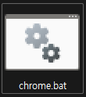  
`chrome` 또는 `chrome.bat` 이라고 써있는 파일을 더블클릭하여 실행해 주세요.  
그리고 [YOUTUBE MUSIC](<https://music.youtube.com>) 이 활성화 된 계정으로 로그인 하면 돼요.  
(혹시라도 로그인을 안한 상태에서 창을 닫았더라도 저 파일을 실행시키면 크롬창이 열려요)  

___그리고 꼭 여기서 열린 크롬창은 닫아주세요!___
</br></br></br>

### 5. 실행하기

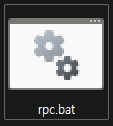  
디스코드 (웹X) 를 실행한 상태에서 `rpc` 나 `rpc.bat` 을 실행하면 됩니다!
</br></br></br>

## 🛟 Help! ME

- 만약 RPC가 표시되지 않으면 해당 탭을 확인해 보시기 바랍니다 :>  
    `사용자 설정` -> `활동 개인정보` -> `활동 상태`  
      

- 이와 같은 에러는 무시해도 돼요! ☺️

    ```log
    [46964:49148:0801/023606.954:ERROR:device_event_log_impl.cc(222)] [02:36:06.954] USB: usb_service_win.cc:415 Could not read device interface GUIDs: 지정된 파일을 찾을 수 없습니다. (0x2)
    ```

- 이와 같은 문구가 뜬다면 열어둔 모든 크롬탭을 끄고 시도해 보세요. 🪟

    ```log
    기존 브라우저 세션에서 여는 중입니다.
    Message: unknown error: Chrome failed to start: exited normally.
    (unknown error: DevToolsActivePort file doesn't exist)
    (The process started from chrome location C:\Program Files\Google\Chrome\Application\chrome.exe is no longer running, so ChromeDriver is assuming that Chrome has crashed.)
    ```

- 이건 뭐죠? 🤔  
    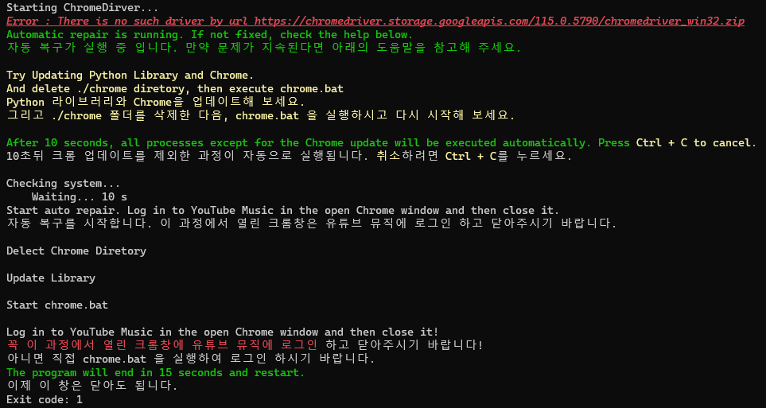  
    보통 파이썬 라이브러리 버전과 크롬의 버전이 일치하지 않아서 발생해요.  
    위와 같이 기본적으로 자동 복구가 실행 되지만,  
    그럼에도 정상 작동하지 않는 경우 아래의 절차를 참고해 보세요. :)  
    1. `./chrome` 와 `./__pycache__` 폴더 삭제  
    2. 크롬 업데이트 (오른쪽 위 점 3개 -> 도움말 -> 크롬 정보)  
    3. `chrome.bat` 실행 후 유튜브 뮤직에 로그인 후 ___꼭 닫기___  
    4. `install_lib.bat` 실행  
    5. `rpc.bat` 실행  
    6. RPC 즐기기 😎  

---

___이 외의 모든 문제는 아래로 문의해 주시기 바랍니다. 🫥___

|||
|:--:|:--:|
|Discord|dal.i|
|Email|<ludals2446@gmail.com>|
